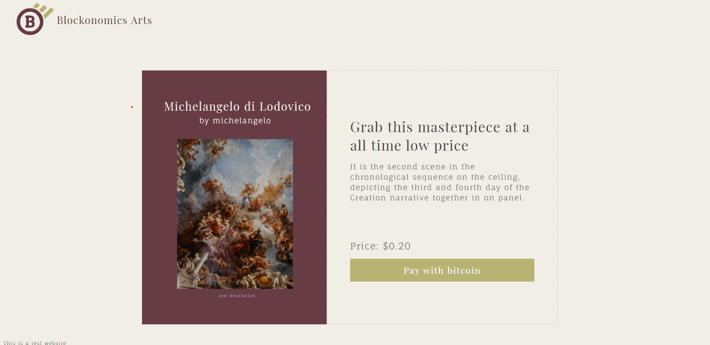
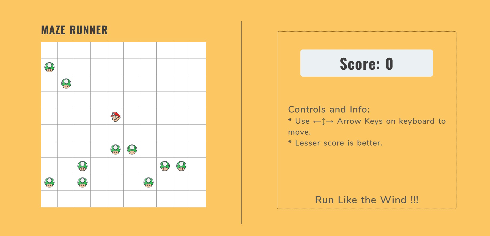
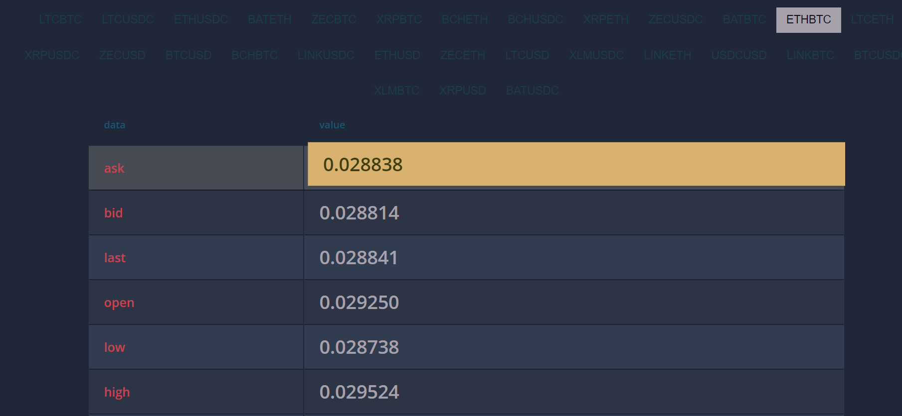
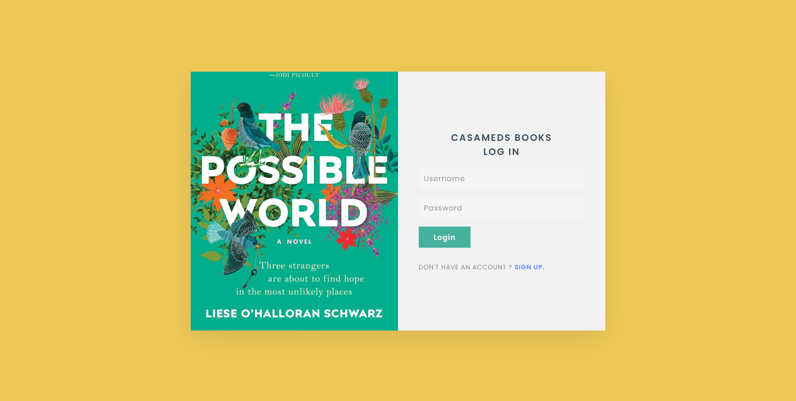
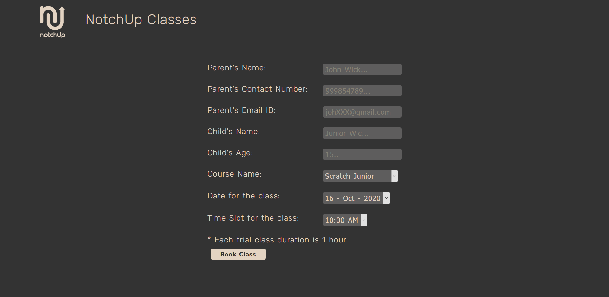

# Mini Projects      
These projects are for technical interview assignments or to practice/learn any specific concept.      
 
 

## [Microservices Api](https://github.com/atiqg/hackerbay_microservices)     
Backend microservices to support and simplify applications. Simple stateless microservices in Nodejs, with three major functionalities: Authentication with **Json web token, JSON Patching and Image Thumbnail Generation.**
Project Include **Dockerizing app, Unit Tests, Code coverage report, Central Logging system, javascript linting and JSdoc**.  
 
 

## [Bitcoin Payment Store](https://github.com/atiqg/blockonomics-bitcoin-payment)     
A web app to buy art by paying with bitcoins. The web app generates wallet address, payment notification and payment verification, user can pay by scanning QR code or by simply copying wallet address. Backend code is written in node.js and hosted on netlify(hosting and functions).
     
 
 

## [React Maze Runner](https://github.com/atiqg/react-maze-runner)     
A simple maze game made with react.js(hooks api purely). It dynamically generates a maze based on user input, then sets few food sprites across the maze and a player in middle. Player needs to eat all the food spwaned on maze in minimum steps possible.
     
 
 

## [Realtime Crypto Exchange Rate](https://github.com/atiqg/accessgate-labs-ticker)     
A web app to showcase "realtime" exchange rate of all crypto-currencies. It fetches all crypto exchange types, then user can select one of them. A Ticker Web Socket is opened with selected exchange rate and realtime changes are shown on UI.
     
 
 

## [User ID Book Store](https://github.com/atiqg/casameds-book-store)    
A desktop app to login/signup and select a book which will be sent to user's email. The app is made with electron.js, node.js and firebase backend. User gets installation file for the app, it support complete error handling while login/signup and store each user with unique user_id.
     
 
 

## [Book trial class](https://github.com/atiqg/NotchUp-test)       
A web app to book trial class on NotchUp education platform. It is made with node.js, web stack and hosted on firebase. The web app fetch courses and available time slots for each course. User is shown time slots starting from at least 4 hours from now or at-max 7 days. Once user select course, date and time for trail class then the data is sent to the server and a confirmation email is sent to user.
     
 
 